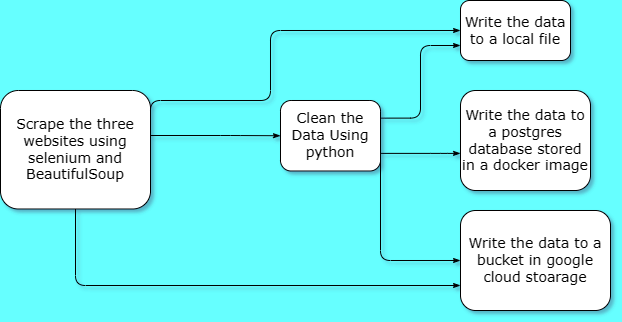
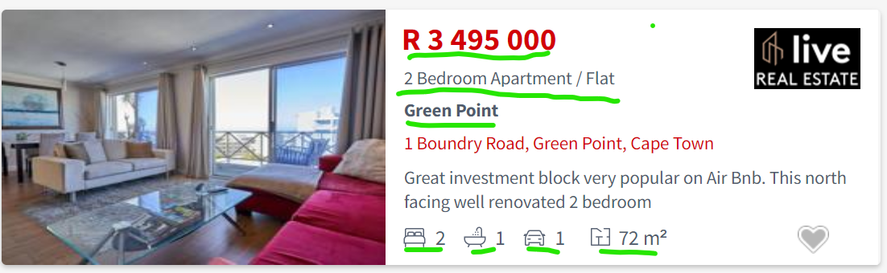
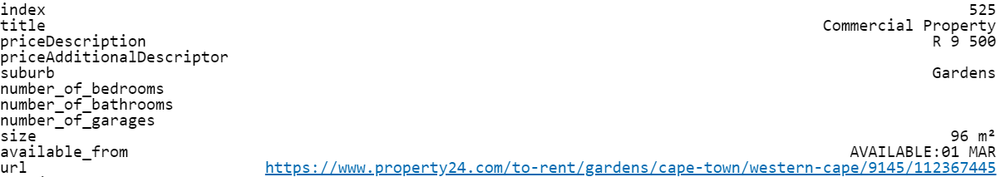
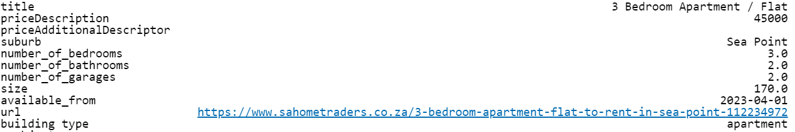

# **Real Estate Scraping project**
## **Overview**
### I created this project to practice data engineering skills including:
1. Webscraping
2. Data cleaning and transformations
3. Writing files locally and to the cloud 
4. Using an orchestration tool

### I used the following technologies:
1. Python 
2. Postgres
3. Docker
4. Google Cloud Storage
5. Prefect (orchestration)

#### FLOW OF THE PROGRAM

## some of the steps:
1. Fetched all this info from each listing in the selected suburbs + the url of the listing

2. End up with hundreds of datapoints like this:

3. After cleaning they look like this, the formats are now usable for analysis

## Possible Use cases for this program:
1. Create real estate price indexes at the province, country or suburb level
2. Automate searches for good deals for personal or investment purposes
## use cases for similar programs:
Collect any sort of structured data from the web at set intervals and use it for personal or commercial purposes

## if you want to use it:
Message me and I'm happy to run through the code with you or help you adjsut it for your purposes
Otherwise I tried to make the functions readable. 
So start at the final_scraper.py file and read through it.

## additions I could do in the future:
1. Dockerize it all so that it can be more easily collaborated on
2. Schedule it to run each day
3. Do more cleaning to make the data more useful
4. Make the code a more readable